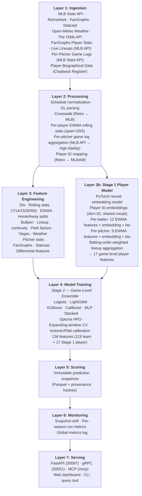
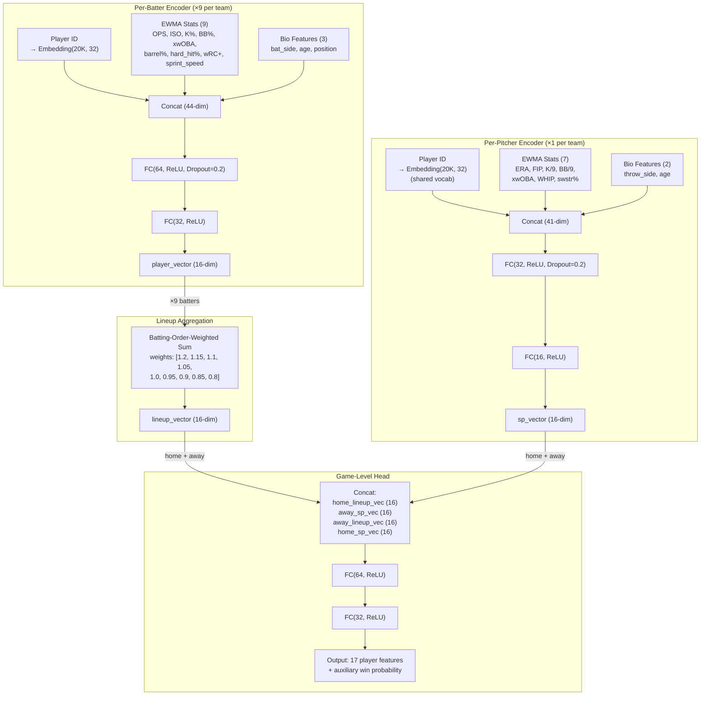
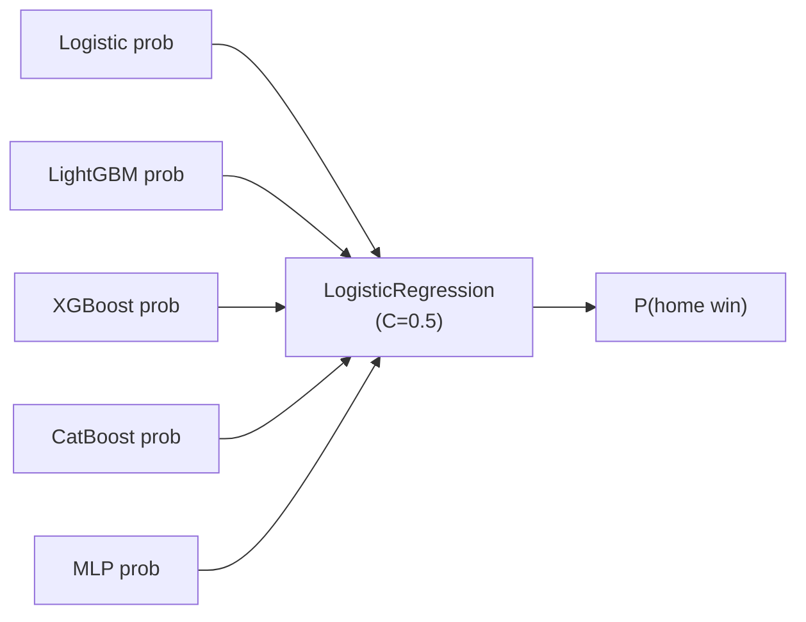
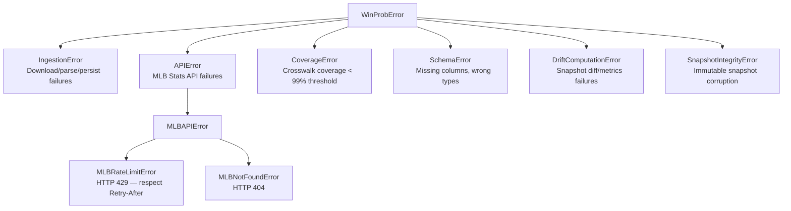

# mlb-predict Specification

This document is a comprehensive technical specification for **mlb-predict** — a research-grade, reproducible MLB win-probability modeling platform. It is intended to serve as a single authoritative reference for understanding, extending, and replicating the system.

---

## Table of Contents

1. [Purpose and Scope](#1-purpose-and-scope)
2. [High-Level Architecture](#2-high-level-architecture)
3. [Technology Stack](#3-technology-stack)
4. [Directory Structure](#4-directory-structure)
5. [Data Sources](#5-data-sources)
6. [Data Layer and Schemas](#6-data-layer-and-schemas)
7. [Feature Engineering](#7-feature-engineering)
8. [Modeling](#8-modeling)
9. [Serving Layer](#9-serving-layer)
10. [API Reference](#10-api-reference)
11. [MCP Server](#11-mcp-server)
12. [gRPC Services](#12-grpc-services)
13. [Container and Deployment](#13-container-and-deployment)
14. [CI/CD Pipeline](#14-cicd-pipeline)
15. [Testing](#15-testing)
16. [Monitoring and Drift Detection](#16-monitoring-and-drift-detection)
17. [Error Taxonomy](#17-error-taxonomy)
18. [Configuration and Environment Variables](#18-configuration-and-environment-variables)
19. [Architectural Governance](#19-architectural-governance)
20. [Roadmap](#20-roadmap)

---

## 1. Purpose and Scope

### 1.1 Goals

mlb-predict provides:

- **Pre-game win probability** for every MLB regular season game from 2000 to present (and pre-season 2026): `P(HomeWin | 136 features)`.
- **Predicted vs actual standings** — division standings with Pythagorean projections.
- **Upset detection** — games where the model-favoured team lost.
- **SHAP attribution** — per-game explanation of which features drove the prediction.
- **Live odds integration** — moneyline odds from The Odds API, converted to implied probabilities and expected-value (EV) opportunities.
- **Drift monitoring** — snapshot-to-snapshot probability drift across daily runs.
- **Web dashboard** — a full interactive web UI covering games, standings, leaders, players, odds.
- **REST API, gRPC API, and MCP server** — machine-readable access to all system outputs.

### 1.2 Scope

| In Scope | Out of Scope |
|---|---|
| Regular season 2000–2026 | Playoffs (excluded from training targets) |
| Spring training (down-weighted) | Real-time in-game prediction |
| Pre-game win probability | Individual player fantasy projections |
| Two-stage model (player embeddings + game ensemble) | Automated wagering |
| Individual player rolling stats (EWMA) | Minor league / prospect projections |
| Live lineup ingestion (MLB Stats API) | In-game lineup substitution modeling |
| Six trained ML models + neural player model | |
| Positive-EV bet identification | |

### 1.3 Conventions

- **Python 3.11+**: type hints on every function, PEP 257 docstrings.
- **Ruff** for linting and formatting; **mypy** for static analysis.
- **Expanding-window CV**: train on seasons < N, evaluate on N — no leakage.
- **Two-stage modeling**: Stage 1 (player embedding model) feeds Stage 2 (game-level ensemble).
- **Immutable snapshots**: prediction Parquet files are never overwritten.
- **Determinism**: identical inputs always produce identical outputs (seeded RNG, canonical sort order).
- **Provenance**: every derived artifact is traceable to its source data via SHA256 hashes.

---

## 2. High-Level Architecture

The system is organized into seven sequential layers:



---

## 3. Technology Stack

### 3.1 Core Runtime

| Component | Technology |
|---|---|
| Language | Python 3.11+ |
| Build system | `hatchling`, `uv` (Astral, pinned 0.10.8) |
| Linting / formatting | `ruff` ≥ 0.6 |
| Type checking | `mypy` |
| Packaging | Editable install (`pip install -e .`) |

### 3.2 Web Framework

| Component | Technology |
|---|---|
| HTTP server | `FastAPI` ≥ 0.111, served by `uvicorn[standard]` ≥ 0.29 |
| Templating | `Jinja2` ≥ 3.1 |
| Serialization | `orjson` ≥ 3.9, `pydantic` |
| Async HTTP | `aiohttp` ≥ 3.9, `aiofiles` ≥ 23.2 |

### 3.3 Machine Learning

| Library | Version | Role |
|---|---|---|
| `scikit-learn` | ≥ 1.4 | Logistic regression, MLP, StandardScaler, IsotonicRegression, Pipeline |
| `lightgbm` | ≥ 4.0 | Gradient-boosted trees (GBDT) |
| `xgboost` | ≥ 2.0 | Gradient-boosted trees with L1/L2 regularization |
| `catboost` | ≥ 1.2 | Ordered boosting with symmetric trees |
| `torch` | ≥ 2.0 | Stage 1 player embedding model (entity embeddings, lineup aggregation) |
| `optuna` | ≥ 3.6 | Bayesian hyperparameter optimization (200 trials per tree model) |
| `shap` | ≥ 0.45 | SHAP feature attribution (`TreeExplainer` for trees) |
| `joblib` | ≥ 1.3 | Model serialization |
| `scipy` | ≥ 1.12 | Logit/sigmoid functions for calibration |
| `numpy` | ≥ 1.26 | Numerical arrays |
| `pandas` | ≥ 2.1 | DataFrames |
| `pyarrow` | ≥ 14.0 | Parquet I/O |
| `pybaseball` | ≥ 2.2 | FanGraphs team/player metrics, Statcast player stats |

### 3.4 gRPC / Protobuf

| Component | Technology |
|---|---|
| Core | `grpcio` ≥ 1.60, `protobuf` ≥ 4.25 |
| Reflection | `grpcio-reflection` ≥ 1.60 |
| Code generation | `grpcio-tools` (dev, build-time) via `scripts/gen_proto.sh` |

### 3.5 MCP

| Component | Technology |
|---|---|
| Framework | `fastmcp` ≥ 3.0 |
| Mount | Streamable HTTP at `/mcp` |

### 3.6 Testing

| Library | Role |
|---|---|
| `pytest` ≥ 8.0 | Test runner |
| `pytest-asyncio` ≥ 0.23 | Async test support (`asyncio_mode = "auto"`) |
| `pytest-mock` ≥ 3.12 | Mocking |
| `hypothesis` ≥ 6.0 | Property-based testing |
| `aioresponses` ≥ 0.7 | Mock async HTTP responses |

### 3.7 Container and Process Management

| Component | Technology |
|---|---|
| Container | Docker multi-stage (`python:3.11-slim`) |
| Process manager | `supervisord` |
| Cron daemon | `supercronic` v0.2.33 |
| Platforms | `linux/amd64`, `linux/arm64` |

---

## 4. Directory Structure

```
mlb-predict/
├── .cursor/plans/                     # Cursor AI plan files
├── .github/workflows/ci.yml          # GitHub Actions CI/CD
├── docker/
│   ├── crontab                        # supercronic schedule
│   ├── entrypoint.sh                  # Container startup / bootstrap detection
│   ├── ingest_daily.sh               # Daily data refresh (01:00 UTC)
│   ├── retrain_daily.sh              # Daily model retrain (20:00 UTC)
│   └── supervisord.conf              # supervisord config
├── docs/
│   └── RETROSHEET_ATTRIBUTION.md     # Retrosheet attribution notice
├── proto/mlb_predict/v1/
│   ├── admin.proto                   # AdminService
│   ├── common.proto                  # Shared messages
│   ├── games.proto                   # GameService
│   ├── models.proto                  # ModelService
│   ├── standings.proto               # StandingsService
│   └── system.proto                  # SystemService
├── scripts/
│   ├── build_crosswalk.py
│   ├── build_features.py
│   ├── build_features_2026.py
│   ├── build_spring_features.py
│   ├── capture_golden_api.py
│   ├── compute_drift.py
│   ├── feature_importance.py
│   ├── gen_proto.sh
│   ├── ingest_all.py
│   ├── ingest_fangraphs.py
│   ├── ingest_odds.py
│   ├── ingest_player_data.py        # Unified player data ingestion (FanGraphs + Statcast + bio + pitcher game logs)
│   ├── ingest_pitcher_stats.py
│   ├── ingest_retrosheet_gamelogs.py
│   ├── ingest_schedule.py
│   ├── ingest_vegas.py
│   ├── ingest_weather.py
│   ├── query_game.py
│   ├── run_predictions.py
│   ├── serve.py
│   ├── train_model.py
│   └── update_daily.sh
├── src/mlb_predict/
│   ├── app/
│   │   ├── main.py                   # FastAPI app: all routes, gRPC gateway, WebSockets
│   │   ├── admin.py                  # Background pipeline runner + WebSocket REPL/shell
│   │   ├── data_cache.py             # In-memory feature and model cache (thread-safe)
│   │   ├── game_detail_cache.py      # Per-game SHAP result cache
│   │   ├── odds_cache.py             # Live odds cache + EV computation
│   │   ├── response_cache.py         # HTTP response cache decorator (TTL-based)
│   │   ├── timing.py                 # TimingMiddleware + context manager
│   │   ├── static/                   # CSS/JS for EV calculator and base UI
│   │   └── templates/                # Jinja2 HTML templates (11 pages)
│   ├── crosswalk/build.py            # Retrosheet → MLB game_pk deterministic mapping
│   ├── drift/compute.py              # Incremental + baseline drift computation
│   ├── errors.py                     # Structured error taxonomy
│   ├── external/
│   │   ├── betting_config.py         # Betting params (Kelly %, budget, flat bet) config + persistence
│   │   ├── odds.py                   # The Odds API client
│   │   ├── odds_config.py            # Odds API key config management
│   │   ├── vegas.py                  # Money-line → implied probability
│   │   └── weather.py                # Open-Meteo client + cache
│   ├── features/
│   │   ├── builder.py                # Assembles 136-feature matrix (v4)
│   │   ├── bullpen.py                # Bullpen usage + ERA proxy rolling features
│   │   ├── elo.py                    # Sequential cross-season Elo ratings
│   │   ├── lineup.py                 # Lineup continuity features
│   │   ├── park_factors.py           # Historical park run factor
│   │   ├── pitcher_stats.py          # Gamelog-based pitcher ERA assembly
│   │   └── team_stats.py             # Multi-window rolling stats, EWMA, streaks, rest
│   ├── grpc/
│   │   ├── generated/                # Auto-generated protobuf/gRPC Python stubs
│   │   ├── server.py                 # gRPC server startup/shutdown
│   │   └── services/
│   │       ├── admin.py
│   │       ├── games.py              # GameService with SHAP attribution
│   │       ├── models.py
│   │       ├── standings.py
│   │       └── system.py
│   ├── ingest/id_map.py              # Team ID mapping utilities
│   ├── logging_config.py             # Structured logging (human/json formats)
│   ├── mcp/server.py                 # FastMCP server (12 tools)
│   ├── mlbapi/
│   │   ├── client.py                 # Async MLB Stats API client (TokenBucket, cache)
│   │   ├── game_feed.py              # Live play-by-play feed
│   │   ├── leaders.py                # League leaders + player stats
│   │   ├── lineups.py                # Live lineup fetcher (confirmed batting orders)
│   │   ├── pitcher_stats.py          # Pitcher stats endpoint
│   │   ├── schedule.py               # Schedule ingestion
│   │   ├── standings.py              # Live standings + team batting/pitching stats
│   │   └── teams.py                  # Teams endpoint
│   ├── model/
│   │   ├── artifacts.py              # Save/load model artifacts (joblib + JSON metadata)
│   │   ├── evaluate.py               # Brier score, accuracy, calibration error
│   │   └── train.py                  # All 6 models, calibrators, stacking, Optuna HPO
│   ├── player/
│   │   ├── __init__.py               # Player data package
│   │   ├── ingestion.py              # FanGraphs player-level + expanded Statcast ingestion
│   │   ├── rolling.py                # Per-player EWMA rolling stats (span=20 batters, 5 pitchers)
│   │   ├── biographical.py           # Player bio data (age, handedness, position)
│   │   ├── pitcher_gamelogs.py       # Per-pitcher game log fetch/cache (MLB Stats API)
│   │   ├── embeddings.py             # PyTorch player embedding model (Stage 1)
│   │   └── lineup_model.py           # Stage 1 lineup aggregation, training, inference
│   ├── predict/snapshot.py           # Immutable prediction snapshot writer
│   ├── retrosheet/gamelogs.py        # Retrosheet GL parser + multi-source downloader
│   ├── standings.py                  # Division mappings, predicted standings, merge logic
│   ├── statcast/
│   │   ├── fangraphs.py              # FanGraphs team-level stats via pybaseball
│   │   └── player_stats.py           # Statcast individual batter/pitcher stats + ID mapping
│   ├── tools/
│   │   ├── knowledge.py              # Feature/model descriptions for MCP tools
│   │   └── run.py                    # Tool dispatcher (MCP and chat)
│   └── util/hashing.py               # SHA256 content hashing utilities
├── tests/
│   ├── conftest.py                   # Shared fixtures
│   ├── golden/                       # Golden API response fixtures
│   ├── integration/
│   │   ├── test_chat_api.py
│   │   ├── test_golden_api.py        # Golden API regression tests
│   │   └── test_odds_api.py
│   ├── property/test_properties.py   # Hypothesis property-based tests
│   └── unit/                         # 18 unit test files (228 tests)
├── AGENTS.md                         # Full engineering specification for AI agents
├── DATA_SCHEMA.md                    # On-disk data contracts and schemas
├── Dockerfile                        # Multi-stage build
├── docker-compose.image.yml          # Compose for GHCR pre-built image
├── docker-compose.yml                # Primary Compose config
├── MODEL_SPEC.md                     # Mathematical modeling specification
├── pyproject.toml                    # Build system, dependencies, tool config
├── README.md                         # User documentation
├── SYSTEM_ARCHITECTURE.md           # Architecture and data flow
├── start.sh / start.bat              # Cross-platform start scripts
└── uv.lock                           # Locked dependency versions
```

---

## 5. Data Sources

| Source | Access | Data Provided | Coverage |
|---|---|---|---|
| **MLB Stats API** (`statsapi.mlb.com`) | Async `aiohttp`, rate-limited (5 rps, burst=10), SHA256-keyed cache | Schedule, pitcher stats, standings, team stats, play-by-play, league leaders | 2000–present |
| **Retrosheet** (Chadwick primary / retrosheet.org fallback) | HTTP download of fixed-width GL text files | Historical game logs (161 columns per game) | 2000–2025 |
| **FanGraphs Team** (via `pybaseball`) | `pybaseball` library (HTTP scraping) | Team wOBA, FIP, xFIP, K%, BB%, barrel%, hard-hit% | 2002–present |
| **FanGraphs Player** (via `pybaseball`) | `pybaseball.batting_stats()`, `pitching_stats()` | Per-player wRC+, OPS, K%, BB%, ISO, BABIP, FIP, xFIP, swinging strike% | 2002–present |
| **Baseball Savant** (via `pybaseball`) | `pybaseball` library | Statcast xwOBA, xBA, xSLG, barrel%, sprint speed per batter/pitcher | 2015–present |
| **MLB Stats API Lineups** | `statsapi.mlb.com` `/game/{game_pk}/boxscore` | Confirmed batting orders (player IDs, positions, batting side) | Current season |
| **MLB Stats API Pitcher Game Logs** | `statsapi.mlb.com` `/people/{id}/stats?stats=gameLog` | Per-pitcher per-game box scores (IP, ER, H, BB, K, HR) | 2000–present |
| **Chadwick Register** | Downloaded CSV | Retrosheet → MLBAM ID crosswalk for Statcast | Full historical |
| **Open-Meteo** (`open-meteo.com`) | REST API by park coordinates | Historical temperature, wind, humidity per game/park | All seasons |
| **The Odds API** | REST API (optional, requires API key) | Live moneyline odds for EV calculation | Current season |

### 5.1 MLB Stats API Client

Location: `src/mlb_predict/mlbapi/client.py`

- Async `aiohttp` client with `TokenBucket(rate=5.0, burst=10.0)`.
- All responses cached at `data/raw/mlb_api/<endpoint>/<sha256>.json`.
- Every request appended to `data/raw/mlb_api/metadata.jsonl` with fields: `ts_unix`, `url`, `params`, `cache_key`, `endpoint`, `status`.
- Retries with exponential backoff on HTTP 429 (respects `Retry-After`) and 5xx errors.
- Direct synchronous or uncached HTTP calls are **forbidden**.

### 5.2 Retrosheet Gamelogs

Location: `src/mlb_predict/retrosheet/gamelogs.py`

- Downloads `GL<YYYY>.TXT` files from Chadwick (primary) with retrosheet.org as fallback.
- Parser converts 161-column fixed-width format to Parquet.
- Provenance: `source_url` and `raw_sha256` stored in metadata.

### 5.3 Crosswalk (Retrosheet → MLB)

Location: `src/mlb_predict/crosswalk/build.py`

- Deterministically maps each Retrosheet game row to an MLB `game_pk` using date, home team code, and game number.
- Emits unresolved lists per season.
- **Invariant**: ≥ 99.0% match rate per season. Any season below threshold triggers a `CoverageError` and is flagged in `crosswalk_seasons_below_threshold.csv`.

### 5.4 Player Data Pipeline (v4)

Location: `src/mlb_predict/player/ingestion.py`, `scripts/ingest_player_data.py`

Unified player data ingestion for the Stage 1 player embedding model. Combines multiple sources per player per season.

**Batter data (per player, per season):**

| Stat | Source | Coverage | Fallback |
|---|---|---|---|
| OPS | Gamelog H/AB/BB/2B/3B/HR | 2000+ | League avg (0.728) |
| ISO | Gamelog extra-base hits | 2000+ | League avg (0.150) |
| K% | Gamelog SO/PA | 2000+ | League avg (0.220) |
| BB% | Gamelog BB/PA | 2000+ | League avg (0.085) |
| wRC+ | FanGraphs `batting_stats()` | 2002+ | OPS-based estimate |
| xwOBA | Statcast `statcast_batter_expected_stats()` | 2015+ | wOBA proxy |
| barrel% | Statcast `statcast_batter_exitvelo_barrels()` | 2015+ | ISO proxy |
| hard hit% | Statcast `statcast_batter_exitvelo_barrels()` | 2015+ | League avg (0.380) |
| sprint speed | Statcast | 2015+ | League avg (27.0 ft/s) |

**Pitcher data (per player, per season):**

| Stat | Source | Coverage | Fallback |
|---|---|---|---|
| ERA | MLB API pitcher game logs (primary) / Retrosheet gamelog approximation (fallback) | 2000+ | League avg (4.50) |
| FIP | FanGraphs `pitching_stats()` / computed from K/BB/HR | 2002+ | ERA proxy |
| K/9 | MLB API pitcher game logs (primary) / Retrosheet gamelog approximation (fallback) | 2000+ | League avg (8.5) |
| BB/9 | MLB API pitcher game logs (primary) / Retrosheet gamelog approximation (fallback) | 2000+ | League avg (3.0) |
| xwOBA allowed | Statcast `statcast_pitcher_expected_stats()` | 2015+ | League avg (0.320) |
| WHIP | MLB API pitcher game logs (primary) / Retrosheet gamelog approximation (fallback) | 2000+ | League avg (1.30) |
| swinging strike % | Statcast | 2015+ | League avg (0.110) |

**Biographical data (per player):**

| Stat | Source | Coverage |
|---|---|---|
| Batting side | Chadwick register / MLB API | All players |
| Throwing side | Chadwick register / MLB API | All players |
| Birth date (→ age) | Chadwick register / MLB API | All players |
| Position category | Roster/lineup data | All players |

**Rolling computation:** EWMA with span=20 games (batters) and span=5 starts (pitchers). Cross-season warm-start: end-of-previous-season EWMA state seeds the beginning of the next season (same approach as team-level rolling stats).

**Pitcher rolling data sources (two-tier):**

1. **High-fidelity (MLB Stats API)**: Per-pitcher game logs fetched via `pitcher_gamelogs.py` provide exact per-game IP, ER, H, BB, K, and HR. Used when API data is available.
2. **Fallback (Retrosheet gamelogs)**: When API game logs are unavailable, pitcher stats are approximated from team-level Retrosheet gamelogs. Innings pitched are estimated from per-team putouts (`home_po / 3.0` and `visiting_po / 3.0`) for accurate per-side IP; falls back to `total_outs / 6.0` only when putout data is missing.

**ID mapping:** Retrosheet player IDs → MLBAM IDs via Chadwick register (same `_retro_to_mlbam_map` function as existing Statcast features).

### 5.5 Live Lineup Data (v4)

Location: `src/mlb_predict/mlbapi/lineups.py`

- **Historical training**: uses Retrosheet `home_1_id..home_9_id` and `visiting_1_id..visiting_9_id` (already available in gamelogs).
- **Current-season scoring**: fetches confirmed batting orders from MLB Stats API `game/{game_pk}/boxscore` endpoint ~2–4 hours before first pitch.
- **Fallback**: if day-of lineup not yet posted, uses previous game's lineup for that team.
- All requests routed through the existing async `MLBAPIClient` (rate-limited, cached).

### 5.6 Per-Pitcher Game Logs (v4)

Location: `src/mlb_predict/player/pitcher_gamelogs.py`, `scripts/ingest_player_data.py`

High-fidelity per-pitcher box scores fetched from the MLB Stats API game log endpoint (`/people/{id}/stats?stats=gameLog&season={year}`). Provides exact per-start IP, ER, H, BB, K, and HR — replacing the team-level Retrosheet approximation used in the fallback path.

- **Ingestion**: `scripts/ingest_player_data.py` collects all starting pitcher MLBAM IDs from Retrosheet gamelogs, then fetches game logs for each pitcher across all requested seasons.
- **Storage**: `data/processed/player/pitcher_gamelogs_YYYY.parquet` — one file per season.
- **Usage**: `build_pitcher_rolling()` in `rolling.py` checks for pitcher game logs first; if unavailable for a given pitcher/season, falls back to the Retrosheet gamelog approximation.
- **Rate safety**: all requests routed through the async `MLBAPIClient` (5 rps, burst=10, cached, exponential backoff on 429/5xx).

---

## 6. Data Layer and Schemas

### 6.1 Storage Conventions

- Every processed dataset is written in **Parquet** (authoritative, typed) and optionally **CSV** (human inspection).
- Parquet files use stable column ordering and deterministic row ordering.
- `game_pk` (MLB Stats API) is the canonical game identifier.
- Checksum files (`*.checksum.json`) include row counts, SHA256 of artifacts, source selection fields, and relevant configuration.

### 6.2 Raw Data Layout

```
data/raw/
├── mlb_api/
│   ├── <endpoint>/
│   │   └── <sha256>.json              # Cached API response
│   └── metadata.jsonl                 # Append-only audit log
└── retrosheet/
    └── gamelogs/
        └── GL<YYYY>.TXT               # Retrosheet game log (raw)
```

### 6.3 Processed Data Layout

| Path | Contents | Key Columns |
|---|---|---|
| `data/processed/schedule/games_YYYY.parquet` | Schedule with scores, game type | `game_pk`, `date`, `home_id`, `away_id`, `game_type` (R/S) |
| `data/processed/retrosheet/gamelogs_YYYY.parquet` | Parsed Retrosheet GL (161 columns) | `home_retro`, `away_retro`, `date`, `home_score`, `away_score` |
| `data/processed/crosswalk/game_id_map_YYYY.parquet` | Retro → MLB game_pk mapping | `retro_game_id`, `game_pk` |
| `data/processed/teams/teams_YYYY.parquet` | MLB team IDs and abbreviations | `team_id`, `abbreviation` |
| `data/processed/pitcher_stats/pitchers_YYYY.parquet` | Individual pitcher season stats | `player_id`, `era`, `k9`, `bb9`, `whip` |
| `data/processed/fangraphs/fangraphs_YYYY.parquet` | FanGraphs team advanced metrics | `team`, `woba`, `fip`, `xfip`, `k_pct`, `bb_pct` |
| `data/processed/statcast_player/` | Statcast batter/pitcher individual stats | `mlbam_id`, `xwoba`, `barrel_pct` |
| `data/processed/player/batter_stats_YYYY.parquet` | FanGraphs per-batter season stats | `mlbam_id`, `wrc_plus`, `ops`, `k_pct`, `bb_pct`, `iso` |
| `data/processed/player/pitcher_stats_YYYY.parquet` | FanGraphs per-pitcher season stats | `mlbam_id`, `fip`, `xfip`, `swstr_pct` |
| `data/processed/player/biographical.parquet` | Player biographical data | `mlbam_id`, `bat_side`, `throw_side`, `birth_date`, `position` |
| `data/processed/player/pitcher_gamelogs_YYYY.parquet` | Per-pitcher per-game box scores (MLB API) | `mlbam_id`, `date`, `ip`, `er`, `h`, `bb`, `k`, `hr` |
| `data/processed/odds/betting_config.json` | Persisted betting configuration (Kelly %, budget, bet amount) | `kelly_pct`, `budget`, `bet_amount` |
| `data/processed/vegas/vegas_YYYY.parquet` | Implied probabilities from money lines | `game_pk`, `home_implied_prob` |
| `data/processed/weather/by_park_date.parquet` | Historical weather per park/date | `venue`, `date`, `temp_f`, `wind_mph`, `humidity` |
| `data/processed/features/features_YYYY.parquet` | 136-feature matrix (regular season, v4) | `game_pk`, `date`, `season`, `home_win`, 136 features |
| `data/processed/features/features_spring_YYYY.parquet` | Spring training features | Same as above, `is_spring=1.0` |
| `data/processed/features/features_2026.parquet` | Pre-season 2026 (no results yet) | Same as above, `home_win=NaN` |
| `data/processed/predictions/season=YYYY/snapshots/` | Immutable prediction Parquet files | See §6.4 |
| `data/processed/drift/run_metrics_YYYY.parquet` | Per-season drift metrics | See §16 |
| `data/processed/drift/global_run_metrics.parquet` | Global deduplicated drift metrics | See §16 |
| `data/models/<type>_v4_train<YYYY>/` | Trained model artifacts (Stage 2) | `model.joblib`, `metadata.json` |
| `data/models/player_embedding_v4_train<YYYY>/` | Stage 1 player embedding model | `model.pt`, `vocab.json`, `metadata.json` |

### 6.4 Prediction Snapshot Schema

Each snapshot is an immutable Parquet file. Columns:

| Column | Type | Description |
|---|---|---|
| `game_pk` | int64 | MLB game identifier |
| `home_team` | string | Home team Retrosheet code |
| `away_team` | string | Away team Retrosheet code |
| `predicted_home_win_prob` | float64 | Model output probability in [0, 1] |
| `run_ts_utc` | string | ISO timestamp of this run |
| `model_version` | string | e.g. `stacked_v4_train2025` |
| `schedule_hash` | string | SHA256 of the schedule Parquet |
| `feature_hash` | string | SHA256 of the feature Parquet |
| `git_commit` | string | HEAD commit SHA |
| `tag` | string | Optional semantic version tag |

Snapshots are **never overwritten**. Each daily run appends a new file.

### 6.5 Feature Matrix Key Columns

The `features_YYYY.parquet` files contain:

| Column | Description |
|---|---|
| `game_pk` | Canonical MLB game identifier |
| `date` | Game date |
| `season` | Season year |
| `game_type` | `R` (regular) or `S` (spring training) |
| `is_spring` | `1.0` for spring training, `0.0` for regular season |
| `home_retro` | Home team Retrosheet code |
| `away_retro` | Away team Retrosheet code |
| `home_win` | Target variable (0/1; NaN for 2026 pre-season) |
| `feature_hash` | SHA256 of the feature row set |
| `schema_version` | Feature schema version (`v4`) |
| *(136 numeric features)* | See §7 |

---

## 7. Feature Engineering

The system produces a **136-feature vector** per game. All features are constructed exclusively from data available before first pitch (no lookahead leakage). Features must be deterministic and stable across schema version `v4`.

The v4 feature set includes all 119 v3 team-level features plus 17 new player-level features from the Stage 1 neural embedding model (see §7.1.16).

### 7.1 Feature Groups

#### 7.1.1 Elo Ratings (3 features)

Location: `src/mlb_predict/features/elo.py`

Sequential cross-season Elo ratings with K=20 and home-field advantage (HFA) offset of +35.

| Feature | Description |
|---|---|
| `home_elo` | Elo rating of the home team before this game |
| `away_elo` | Elo rating of the away team before this game |
| `elo_diff` | `home_elo − away_elo` |

Implementation notes:

- Ratings persist across season boundaries (no reset).
- Ratings are computed sequentially in chronological order.
- HFA offset is applied only to the home team's effective rating for the purpose of expected-score calculation.

#### 7.1.2 Multi-Window Rolling Stats (30 features)

Location: `src/mlb_predict/features/team_stats.py`

Rolling windows of **7, 14, 15, 30, and 60** games. Applied separately to home and away teams; differentials computed for selected windows. Cross-season warm-start: the end-of-previous-season state seeds the first window of the next season.

| Feature Group | Windows | Features |
|---|---|---|
| Win percentage | 7, 14, 15, 30, 60 | `home_win_pct_7`, `home_win_pct_14`, `home_win_pct_15`, `home_win_pct_30`, `home_win_pct_60`, `away_win_pct_*` |
| Run differential | 7, 14, 15, 30, 60 | `home_run_diff_7`, `home_run_diff_14`, `home_run_diff_15`, `home_run_diff_30`, `home_run_diff_60`, `away_run_diff_*` |
| Pythagorean expectation | 7, 14, 15, 30, 60 | `home_pythag_7`, `home_pythag_14`, `home_pythag_15`, `home_pythag_30`, `home_pythag_60`, `away_pythag_*` |

Pythagorean exponent: 1.83 (standard baseball formula).

> **Note on redundant features:** The 7-game and 14-game window features (12 total) are highly correlated (r > 0.95) with the 15-game equivalents and are excluded from tree-model training by default via `select_features()`. They are still computed and stored in the feature matrix for the logistic regression and MLP models that benefit from them.

#### 7.1.3 EWMA Rolling Stats (7 features)

Location: `src/mlb_predict/features/team_stats.py`

Exponentially weighted moving averages with span=20 games.

| Feature | Description |
|---|---|
| `home_win_ewm` | EWMA win percentage (home team) |
| `away_win_ewm` | EWMA win percentage (away team) |
| `home_rd_ewm` | EWMA run differential (home team) |
| `away_rd_ewm` | EWMA run differential (away team) |
| `home_pythag_ewm` | EWMA Pythagorean (home team) |
| `away_pythag_ewm` | EWMA Pythagorean (away team) |
| `pythag_ewm_diff` | `home_pythag_ewm − away_pythag_ewm` |

#### 7.1.4 Home/Away Performance Splits (6 features)

| Feature | Description |
|---|---|
| `home_win_pct_home_only` | Rolling win% in home games only (home team) |
| `away_win_pct_away_only` | Rolling win% in road games only (away team) |
| `home_pythag_home_only` | Rolling Pythagorean in home games (home team) |
| `away_pythag_away_only` | Rolling Pythagorean in road games (away team) |
| `home_away_split_diff` | `home_win_pct_home_only − away_win_pct_away_only` |
| `pythag_ha_diff` | `home_pythag_home_only − away_pythag_away_only` |

#### 7.1.4b Run Distribution (4 features)

Location: `src/mlb_predict/features/team_stats.py`

| Feature | Description |
|---|---|
| `home_run_std_30` | Standard deviation of runs scored per game over 30 games (home team) |
| `away_run_std_30` | Standard deviation of runs scored per game over 30 games (away team) |
| `home_one_run_win_pct_30` | Win percentage in one-run games over 30 games (home team) |
| `away_one_run_win_pct_30` | Win percentage in one-run games over 30 games (away team) |

These features capture bullpen depth and late-game management quality independent of the raw bullpen usage features.

#### 7.1.5 Streaks, Rest, and Context (9 features)

| Feature | Description |
|---|---|
| `home_streak` | Current win (+) / loss (−) streak |
| `away_streak` | Current win (+) / loss (−) streak |
| `home_rest_days` | Days since last game (capped at 10) |
| `away_rest_days` | Days since last game (capped at 10) |
| `season_progress` | `game_index / total_games` — 0.0 = opener, 1.0 = final day |
| `day_night` | Float: 1.0 for night games, 0.0 for day games |
| `interleague` | Float: 1.0 for interleague matchups, 0.0 otherwise |
| `day_of_week` | Float 0.0–1.0 (Monday=0.0, Sunday=1.0, normalized by /6) |
| `is_spring` | Float: 1.0 for spring training, 0.0 for regular season (also in §7.1.14) |

#### 7.1.6 Starting Pitcher Quality (8 features)

Location: `src/mlb_predict/features/pitcher_stats.py`

Prior-season ERA assembled from gamelog-based pitcher stats (MLB Stats API). ERA blended for pitchers with insufficient innings.

| Feature | Description |
|---|---|
| `home_sp_era` | Starting pitcher ERA (home, prior season) |
| `away_sp_era` | Starting pitcher ERA (away, prior season) |
| `home_sp_k9` | Strikeouts per 9 innings (home SP) |
| `away_sp_k9` | Strikeouts per 9 innings (away SP) |
| `home_sp_bb9` | Walks per 9 innings (home SP) |
| `away_sp_bb9` | Walks per 9 innings (away SP) |
| `home_sp_whip` | WHIP (home SP) |
| `sp_era_diff` | `away_sp_era − home_sp_era` (positive = home advantage) |

#### 7.1.7 FanGraphs Advanced Team Metrics (24 features)

Location: `src/mlb_predict/statcast/fangraphs.py`

Prior-season team-level advanced metrics from FanGraphs via `pybaseball`. Features use `bat_` prefix for batting stats and `pit_` prefix for pitching stats.

**Batting (6 stats × 2 teams = 12 features):**

| Feature | Description |
|---|---|
| `home_bat_woba`, `away_bat_woba` | Weighted on-base average |
| `home_bat_barrel_pct`, `away_bat_barrel_pct` | Barrel % |
| `home_bat_hard_pct`, `away_bat_hard_pct` | Hard hit % |
| `home_bat_iso`, `away_bat_iso` | Isolated power (SLG − AVG) |
| `home_bat_babip`, `away_bat_babip` | Batting average on balls in play |
| `home_bat_xwoba`, `away_bat_xwoba` | Expected weighted on-base average |

**Pitching (6 stats × 2 teams = 12 features):**

| Feature | Description |
|---|---|
| `home_pit_fip`, `away_pit_fip` | Fielding Independent Pitching |
| `home_pit_xfip`, `away_pit_xfip` | Expected FIP |
| `home_pit_k_pct`, `away_pit_k_pct` | Team strikeout % |
| `home_pit_bb_pct`, `away_pit_bb_pct` | Team walk % |
| `home_pit_hr_fb`, `away_pit_hr_fb` | HR/FB ratio |
| `home_pit_whip`, `away_pit_whip` | WHIP (FanGraphs) |

Default fallback values (when a team's FanGraphs data is unavailable): `bat_woba=0.320`, `bat_barrel_pct=0.08`, `bat_hard_pct=0.38`, `bat_iso=0.170`, `bat_babip=0.300`, `bat_xwoba=0.320`, `pit_fip=4.20`, `pit_xfip=4.20`, `pit_k_pct=0.22`, `pit_bb_pct=0.085`, `pit_hr_fb=0.11`, `pit_whip=1.30`.

#### 7.1.8 Statcast Individual Stats (6 features)

Location: `src/mlb_predict/statcast/player_stats.py`

Lineup-weighted xwOBA and barrel% for batters (prior-season player-level); estimated xwOBA allowed for starting pitchers.

| Feature | Description |
|---|---|
| `home_lineup_xwoba` | Lineup-weighted xwOBA (home batters, prior season) |
| `away_lineup_xwoba` | Lineup-weighted xwOBA (away batters, prior season) |
| `home_lineup_barrel_pct` | Lineup-weighted barrel% (home batters, prior season) |
| `away_lineup_barrel_pct` | Lineup-weighted barrel% (away batters, prior season) |
| `home_sp_est_woba` | Estimated xwOBA allowed by home starting pitcher (prior season) |
| `away_sp_est_woba` | Estimated xwOBA allowed by away starting pitcher (prior season) |

Falls back to league-average constants (`_LEAGUE_AVG_XWOBA`, `_LEAGUE_AVG_BARREL_PCT`, `_LEAGUE_AVG_PIT_EST_WOBA`) when Statcast data or lineup columns are unavailable.

#### 7.1.9 Bullpen (8 features)

Location: `src/mlb_predict/features/bullpen.py`

Rolling bullpen usage and ERA proxy at 15 and 30 game windows.

| Feature | Description |
|---|---|
| `home_bullpen_usage_15`, `home_bullpen_usage_30` | Bullpen IP per game (home, 15/30 window) |
| `away_bullpen_usage_15`, `away_bullpen_usage_30` | Bullpen IP per game (away, 15/30 window) |
| `home_bullpen_era_15`, `home_bullpen_era_30` | Bullpen ERA proxy (home, 15/30 window) |
| `away_bullpen_era_15`, `away_bullpen_era_30` | Bullpen ERA proxy (away, 15/30 window) |

#### 7.1.10 Lineup Continuity (2 features)

Location: `src/mlb_predict/features/lineup.py`

| Feature | Description |
|---|---|
| `home_lineup_continuity` | Fraction of prior game's lineup retained (home team) |
| `away_lineup_continuity` | Fraction of prior game's lineup retained (away team) |

#### 7.1.11 Park Factor (1 feature)

Location: `src/mlb_predict/features/park_factors.py`

| Feature | Description |
|---|---|
| `park_run_factor` | Median runs-per-game at the venue vs. league average (from historical gamelogs) |

#### 7.1.12 Vegas Implied Probability (2 features)

Location: `src/mlb_predict/external/vegas.py`

| Feature | Description |
|---|---|
| `vegas_implied_home_win` | Home team implied win probability derived from opening moneyline |
| `vegas_line_movement` | Change in implied probability from opening line to close |

Money-line → implied probability conversion removes vig using the standard formula.

#### 7.1.13 Weather (3 features)

Location: `src/mlb_predict/external/weather.py`

Historical weather from Open-Meteo API keyed by park coordinates and date.

| Feature | Description |
|---|---|
| `game_temp_f` | Game-time temperature (°F) |
| `game_wind_mph` | Wind speed (mph) |
| `game_humidity` | Relative humidity (%) |

#### 7.1.14 Spring Training Indicator (1 feature)

| Feature | Description |
|---|---|
| `is_spring` | `1.0` for spring training games, `0.0` for regular season |

Spring training games are included in training with a reduced sample weight (default 0.25×).

#### 7.1.15 Differential Features (12 features, computed)

The following differential features are computed from the raw home/away features above and appended to the feature matrix:

| Feature | Formula |
|---|---|
| `pythag_diff_30` | `home_pythag_30 − away_pythag_30` |
| `pythag_diff_ewm` | `home_pythag_ewm − away_pythag_ewm` |
| `home_away_split_diff` | `home_win_pct_home_only − away_win_pct_away_only` |
| `sp_era_diff` | `away_sp_era − home_sp_era` (positive = home advantage) |
| `woba_diff` | `home_bat_woba − away_bat_woba` |
| `fip_diff` | `away_pit_fip − home_pit_fip` (positive = home advantage) |
| `xwoba_diff` | `home_bat_xwoba − away_bat_xwoba` |
| `whip_diff` | `away_pit_whip − home_pit_whip` (positive = home advantage) |
| `iso_diff` | `home_bat_iso − away_bat_iso` |
| `lineup_strength_diff` | `home_lineup_strength − away_lineup_strength` (Stage 1) |
| `sp_quality_diff` | `home_sp_quality − away_sp_quality` (Stage 1) |
| `matchup_advantage_diff` | `home_lineup_vs_sp − away_lineup_vs_sp` (Stage 1) |

#### 7.1.16 Stage 1 Player Model Features (14 features + 3 differentials)

Location: `src/mlb_predict/player/lineup_model.py`, `src/mlb_predict/player/embeddings.py`

These features are produced by the Stage 1 neural player embedding model (see §8.2). The model ingests per-player EWMA rolling stats, learned player ID embeddings, and biographical data, then aggregates across the batting lineup using batting-order position weights.

**Per-team features (7 × 2 teams = 14 features):**

| Feature | Description |
|---|---|
| `home_lineup_strength`, `away_lineup_strength` | Overall neural lineup quality score (sigmoid output, 0–1 scale). Aggregates all 9 batter embeddings weighted by batting order position. |
| `home_top3_quality`, `away_top3_quality` | Average player quality score of batters 1–3 in the lineup. Captures top-of-order strength. |
| `home_bottom3_quality`, `away_bottom3_quality` | Average player quality score of batters 7–9 in the lineup. Captures lineup depth. |
| `home_lineup_variance`, `away_lineup_variance` | Standard deviation of individual player quality scores across the 9-man lineup. High variance = top-heavy lineup; low variance = balanced. |
| `home_platoon_advantage`, `away_platoon_advantage` | Learned platoon interaction: how much the lineup benefits from L/R matchups vs. the opposing starting pitcher. Derived from batter handedness embeddings interacting with SP handedness. |
| `home_sp_quality`, `away_sp_quality` | Neural starting pitcher quality score. Combines SP embedding with EWMA rolling stats (ERA, FIP, K/9, BB/9, xwOBA, WHIP, swinging strike %). |
| `home_lineup_vs_sp`, `away_lineup_vs_sp` | Matchup interaction score: the learned interaction between a team's lineup strength and the opposing SP's quality. Captures how well the lineup is expected to perform against the specific opposing pitcher. |

**Differentials (3 features, included in §7.1.15):**

| Feature | Formula |
|---|---|
| `lineup_strength_diff` | `home_lineup_strength − away_lineup_strength` |
| `sp_quality_diff` | `home_sp_quality − away_sp_quality` |
| `matchup_advantage_diff` | `home_lineup_vs_sp − away_lineup_vs_sp` |

**Stage 1 internal inputs (not directly in Stage 2 feature matrix):**

The Stage 1 model internally processes these per-player features (not exposed to Stage 2):

*Per-batter (EWMA span=20 games, 12 features + 32-dim embedding):*

- Player ID → learned embedding vector (dim=32, vocab ≈ 20,000)
- OPS, ISO, K%, BB% (from Retrosheet gamelogs, 2000+)
- xwOBA, barrel%, hard hit% (from Statcast, 2015+; fallbacks for earlier)
- wRC+ (from FanGraphs, 2002+; OPS-based fallback)
- sprint speed (from Statcast, 2015+; league avg fallback)
- batting side (−1 L, +1 R, 0 switch), age (normalized to peak 27–28), position category

*Per-pitcher (EWMA span=5 starts, 9 features + 32-dim embedding):*

- Player ID → learned embedding vector (shared vocab with batters)
- ERA, K/9, BB/9, WHIP (from gamelogs, 2000+)
- FIP (from FanGraphs/computed, 2002+), xwOBA allowed, swinging strike % (Statcast, 2015+)
- throwing side (−1 L, +1 R), age (normalized)

**Fallback behavior:** For seasons before Statcast (pre-2015) or FanGraphs (pre-2002), missing per-player features use era-appropriate league averages. For unknown players (not in embedding vocabulary), a stat-to-embedding projection network initializes embeddings from observable stats.

### 7.2 Feature Count Summary

The total feature vector is **136 features** (v4), with the following composition:

| Group | Count |
|---|---|
| Elo ratings | 3 |
| Multi-window rolling (7/14/15/30/60 × win%, run diff, Pythagorean × 2 teams) | 30 |
| EWMA rolling (span=20, win%, run diff, Pythagorean × 2 teams) | 6 |
| Home/away performance splits | 4 |
| Run distribution (std, one-run win%) | 4 |
| Streaks and rest days | 4 |
| Starting pitcher stats (ERA, K/9, BB/9, WHIP) | 8 |
| FanGraphs batting (wOBA, barrel%, hard%, ISO, BABIP, xwOBA × 2 teams) | 12 |
| FanGraphs pitching (FIP, xFIP, K%, BB%, HR/FB, WHIP × 2 teams) | 12 |
| Statcast lineup-weighted (xwOBA, barrel% × 2 teams) | 4 |
| Statcast SP estimated xwOBA allowed | 2 |
| Lineup continuity | 2 |
| Bullpen (usage + ERA proxy × 15/30 windows × 2 teams) | 8 |
| Park run factor | 1 |
| Season progress | 1 |
| Contextual (day/night, interleague, day of week) | 3 |
| Vegas (implied probability, line movement) | 2 |
| Weather (temperature, wind, humidity) | 3 |
| Spring training indicator | 1 |
| Differential features (9 team + 3 player) | 12 |
| **Stage 1 player model outputs (§7.1.16)** | **14** |
| **Total** | **136** |

> Although the 7-game and 14-game windows add 12 features to the stored matrix, `select_features()` in `train.py` drops these for tree models (LightGBM, XGBoost, CatBoost) at training time since they are highly correlated (r > 0.95) with the 15-game equivalents. Logistic regression and MLP use the full 136-feature set.

---

## 8. Modeling

### 8.1 Problem Formulation

Binary classification using a two-stage architecture: for each pre-game, estimate:

```
P(HomeWin | x_g)   where x_g ∈ ℝ^136
```

**Stage 1** (Player Model): a PyTorch neural embedding model processes per-player EWMA stats and learned player ID embeddings to produce 17 game-level player features.

**Stage 2** (Game Ensemble): the six-model ensemble consumes all 136 features (119 team-level + 17 Stage 1 player) to produce calibrated win probabilities.

Output is a calibrated probability in [0, 1]. Evaluated by Brier score, accuracy, and calibration error. All reported metrics are fully out-of-sample (expanding-window CV).

### 8.2 Stage 1: Player Embedding Model

Location: `src/mlb_predict/player/embeddings.py`, `src/mlb_predict/player/lineup_model.py`

A PyTorch neural network that learns dense player representations and produces game-level lineup/pitcher quality features. Trained end-to-end on the same binary win/loss target.

#### 8.2.1 Architecture



**Batting order weights**: position-based scaling factors `[1.20, 1.15, 1.10, 1.05, 1.00, 0.95, 0.90, 0.85, 0.80]` (1st batter weighted highest). Weights are normalized to sum to 1.0.

#### 8.2.2 Embedding Vocabulary

- **Vocabulary size**: ~20,000 unique MLBAM player IDs across 2000–2026.
- **Embedding dimension**: 32.
- **Shared vocabulary**: batters and pitchers share the same embedding table (many players bat and pitch in Retrosheet data).
- **Vocabulary mapping**: `vocab.json` maps MLBAM ID → embedding index. Index 0 is reserved for unknown/unseen players.

#### 8.2.3 Cold-Start Strategy

Players not in the training vocabulary receive a **stat-to-embedding fallback**:

1. Two small projection networks — one for batters (`batter_stat_proj`, `FC(batter_stat_features, 32)`) and one for pitchers (`pitcher_stat_proj`, `FC(pitcher_stat_features, 32)`) — are trained alongside the main model.
2. During training, an auxiliary loss regularizes learned embeddings against the stat-predicted embedding for **both batters and pitchers**: `λ × (||e_bat_learned − e_bat_predicted||² + ||e_pit_learned − e_pit_predicted||²)` (default `λ = 0.01`). Pitcher regularization covers both home and away starting pitchers.
3. At inference, unseen player IDs use the appropriate projection network (batter or pitcher) to generate embeddings from their observable stats.
4. Players with fewer than 20 plate appearances (batters) or 3 starts (pitchers) in the EWMA window receive linearly blended embeddings: `α × e_learned + (1−α) × e_stat_predicted`, where `α = min(1.0, n_games / 20)`.

#### 8.2.4 Training Configuration

| Parameter | Value |
|---|---|
| Optimizer | AdamW |
| Learning rate | 1e-3 |
| Weight decay | 1e-4 |
| Batch size | 512 |
| Max epochs | 50 |
| Early stopping | Patience=5, monitored on val Brier score |
| Embedding regularization (λ) | 0.01 (applied to both batter and pitcher stat projections) |
| Dropout | 0.2 (per-player encoders) |
| Loss | Binary cross-entropy (win/loss) |
| Seed | 42 (deterministic) |

#### 8.2.5 Stage 1 Output Extraction

After training, the 17 game-level features are extracted from the penultimate layer of the game-level head and from aggregation statistics:

| Feature | Extraction Method |
|---|---|
| `lineup_strength` | Sigmoid of weighted lineup vector norm |
| `top3_quality` | Mean of player vectors for batters 1–3 |
| `bottom3_quality` | Mean of player vectors for batters 7–9 |
| `lineup_variance` | Std dev of player vector norms across 9 batters |
| `platoon_advantage` | Dot product of lineup handedness encoding with opposing SP handedness |
| `sp_quality` | Sigmoid of SP vector norm |
| `lineup_vs_sp` | Learned interaction from game-level head (penultimate layer output) |

During training, outputs are generated on-the-fly within the expanding-window CV loop and injected directly into the in-memory feature DataFrames. At serving time, the production Stage 1 model checkpoint is loaded and inference runs at startup to populate features before scoring.

#### 8.2.6 Artifact Persistence

- Model checkpoint: `data/models/player_embedding_v4_train<YYYY>/model.pt`
- Vocabulary: `data/models/player_embedding_v4_train<YYYY>/vocab.json`
- Metadata: `data/models/player_embedding_v4_train<YYYY>/metadata.json`

### 8.3 Stage 2 Training Protocol

All six game-level models share the same training protocol (unchanged from v3, except version bump and feature count):

1. **Expanding-window cross-validation**: for season N, train only on seasons < N, evaluate on N. No future data leaks into training or calibration.
2. **Time-weighted sample weights**: exponential decay at `rate=0.12` per season — `weight = exp(-0.12 × (max_season - season))`. Recency bias adapts the model to rule changes (e.g. pitch clock 2023, shift ban 2023).
3. **Spring training weighting**: spring training games receive `0.25×` weight (configurable via `--spring-weight`).
4. **Pre-training validation**: all seasons 2000–current must have schedule and feature files present before training starts. Stage 1 features must also be present.
5. **Feature selection**: the active feature set is the intersection of columns present across all season DataFrames. For tree models (LightGBM, XGBoost, CatBoost), 12 redundant short-window features (7-game and 14-game rolling stats, identified as r > 0.95 correlated with 15-game equivalents) are additionally pruned via `select_features()` before fitting.
6. **Calibration split**: the training set is split **85/15**. The 15% calibration split is divided in half: the first half calibrates base models (isotonic or Platt), the second half fits the stacked meta-learner. Base-model probabilities on the meta-learner split are always out-of-sample.
7. **Artifact versioning**: current production version is `v4`.
8. **Two-stage ordering**: Stage 1 (player embedding) must complete before Stage 2 begins. Stage 1 features are pre-computed in a single O(n) expanding-window pass before the CV loop; see §8.4.
9. **O(n) Stage 1 pre-computation**: Instead of retraining Stage 1 inside each CV fold (which would be O(n²)), Stage 1 features for all seasons are pre-generated in a single expanding-window pass. For each evaluation season N (chronologically), Stage 1 trains on seasons < N, infers features for season N, then advances. The resulting features are injected into the in-memory DataFrames once, and the Stage 2 CV loop consumes them directly.

### 8.4 Two-Stage Training Pipeline

```
1. Ingest player data (FanGraphs player, expanded Statcast, biographical, pitcher game logs)
2. Compute per-player EWMA rolling stats (span=20 batters, span=5 pitchers)
3. Pre-compute Stage 1 features (O(n) expanding-window pass):
   a. For each evaluation season N (chronologically):
      - Train Stage 1 on player data from seasons < N
      - Generate Stage 1 features for season N
   b. Inject all Stage 1 features into in-memory feature DataFrames
4. Build v4 feature matrix (existing 119 features + 17 Stage 1 outputs)
5. Run Optuna HPO for tree models (200 trials each)
6. Train Stage 2 game-level models (6-model ensemble, 136 features)
7. Run expanding-window CV and compute metrics
```

Stage 1 and Stage 2 use the same expanding-window protocol. For season N:

- Stage 1 is trained on player data from seasons < N (during the single pre-computation pass).
- Stage 1 features for season N are generated using the Stage 1 model trained on seasons < N.
- Stage 2 trains on all features (including pre-computed Stage 1 outputs) from seasons < N and evaluates on N.

This O(n) pre-computation approach replaces the naive O(n²) approach where Stage 1 would be retrained inside each Stage 2 CV fold.

### 8.5 Stage 2 Models

#### 8.5.1 Logistic Regression (baseline)

Regularized linear model. Serves as the interpretable baseline and fallback.

- Formulation: `p_g = σ(wᵀ z_g + b)` where `z_g` is z-score normalized.
- Regularization: L2 (ridge), `C=1.0`.
- Solver: L-BFGS, up to 1,000 iterations.
- Calibration: Platt sigmoid (`σ(a·logit + b)`).
- SHAP: computed directly from `coef × z-score` (no approximate explainer needed).
- Use: audit, interpretability, baseline comparison.

#### 8.5.2 LightGBM

Gradient-boosted decision trees. Captures non-linear feature interactions.

- Hyperparameters: 200-trial Optuna Bayesian search minimising out-of-sample Brier score. Typical result: `num_leaves≈63`, `learning_rate≈0.05`, `n_estimators≈500`.
- Best HPO stored at: `data/models/hpo_lightgbm.json`.
- Calibration: isotonic regression.
- SHAP: `shap.TreeExplainer`.
- Use: fast batch inference; competitive with XGBoost.

#### 8.5.3 XGBoost

Gradient-boosted trees with separate L1/L2 leaf regularization.

- Hyperparameters: 200-trial Optuna Bayesian search. Typical result: `max_depth≈6`, `learning_rate≈0.05`, `n_estimators≈500`.
- Best HPO stored at: `data/models/hpo_xgboost.json`.
- Calibration: isotonic regression.
- SHAP: `shap.TreeExplainer`.
- Use: best single-model Brier score.

#### 8.5.4 CatBoost

Yandex's ordered-boosting algorithm with symmetric (oblivious) decision trees. Acts as a complementary tree model in the stacked ensemble.

- Architecture: symmetric trees with ordered boosting.
- Regularization: L2 leaf regularization (`l2_leaf_reg`), learning rate decay.
- Calibration: isotonic regression.
- SHAP: `shap.TreeExplainer`.
- Container compatibility: `train_dir` is hardcoded to `/tmp/catboost_info` to avoid permission errors on read-only volumes in Docker.

#### 8.5.5 MLP (Neural Network)

Multi-layer perceptron with three hidden layers.

- Architecture: 128 → 64 → 32 → 1, ReLU activations, Adam optimizer.
- Input normalization: z-score standardization.
- Regularization: L2 weight decay (alpha).
- Calibration: Platt sigmoid.
- SHAP: not supported (coefficient ranking used instead).

#### 8.5.6 Stacked Ensemble (default production model)

The meta-learner blends calibrated probability outputs of the five base models. It never sees raw features.



- Meta-learner: `LogisticRegression(C=0.5)` fit on the second half of the 15% calibration split (the first half is used for base-model calibration), so base-model probabilities are always out-of-sample at meta-learner fit time.
- During cross-validation, a simple **average ensemble** (`avg_ensemble`) — unweighted mean of base-model probabilities — is also evaluated alongside the stacked ensemble as a comparison baseline.
- Use: achieves the best overall Brier score and calibration.

### 8.6 Evaluation Metrics

| Metric | Description |
|---|---|
| **Brier score** | Mean squared probability error: `E[(p − y)²]`. Lower = better. Range [0, 1]. |
| **Accuracy** | % of games where the model's favourite (p > 0.5) won. |
| **Calibration error** | Mean absolute deviation between predicted probability bins and observed win rate. |

### 8.7 Out-of-Sample Results

v4 results will be available after the next training run with Stage 1 player features.

Full season-by-season CV results: `data/models/cv_summary_v4.json`.

### 8.8 Model Versioning

- **Major** (`v1 → v2 → v3 → v4`): feature schema changes.
- **Minor**: new features or calibration approach within the same schema.
- **Patch**: bug fixes without schema changes.

Artifact paths:

- Stage 2: `data/models/<type>_v4_train<YYYY>/`
  - `model.joblib` — serialized pipeline (scaler + model + calibrator)
  - `metadata.json` — CV summary, feature list, training config, hashes
- Stage 1: `data/models/player_embedding_v4_train<YYYY>/`
  - `model.pt` — PyTorch checkpoint (embeddings + encoder + game head)
  - `vocab.json` — player ID → embedding index mapping
  - `metadata.json` — training config, covered seasons, embedding dimensions

### 8.9 Hot-Swapping Models

The active model can be changed at runtime without restarting the server:

- HTTP: `POST /api/admin/switch-model` with `{"model_type": "xgboost"}`
- gRPC: `ModelService.SwitchModel`
- All subsequent predictions use the newly loaded model from the in-memory `data_cache`.

---

## 9. Serving Layer

### 9.1 FastAPI Application

Location: `src/mlb_predict/app/main.py`

- Served by `uvicorn[standard]` on port **30087**.
- Acts as a gRPC gateway: when gRPC stubs are available, HTTP endpoints proxy transparently to gRPC and fall back to direct Python calls otherwise.
- All HTML pages rendered via Jinja2 templates.
- Static assets (CSS/JS) served from `src/mlb_predict/app/static/`.
- **MCP resilience**: `create_mcp_app()` is wrapped in try/except at module level; if it fails, `_mcp_app` is set to `None` and the `/mcp` mount is skipped. The `_combined_lifespan` also catches MCP lifespan failures so the server always starts — critical on fresh installs where the MCP or gRPC dependencies may be unavailable.
- **Auto-bootstrap**: when `try_startup()` detects no data/models, an `_auto_bootstrap()` async task is created to run the full ingest + retrain pipeline. All page routes check `is_ready()` and show the bootstrap dashboard (`initializing.html`) until complete.

### 9.2 In-Memory Cache

Location: `src/mlb_predict/app/data_cache.py`

- Thread-safe, loaded once at startup.
- Holds all feature Parquet files and the active production model.
- For v4 models, runs Stage 1 inference at startup: loads the production player embedding model, loads per-pitcher game logs (MLB API) for high-fidelity pitcher rolling stats, computes per-player rolling stats from gamelogs, and populates the 17 player features before scoring. Falls back gracefully to zero features if the Stage 1 model or player data is unavailable.
- Pre-computes win probabilities for all games at startup.
- SHAP results cached per-game at `src/mlb_predict/app/game_detail_cache.py`.
- Live odds cached with TTL at `src/mlb_predict/app/odds_cache.py`.
- HTTP responses cached with TTL at `src/mlb_predict/app/response_cache.py`.

### 9.3 Admin Pipelines

Location: `src/mlb_predict/app/admin.py`

Background pipeline runner that powers the admin UI, WebSocket endpoints, and bootstrap dashboard:

- `POST /api/admin/ingest` — full re-ingest (async, streaming progress).
- `POST /api/admin/update` — update current season only.
- `POST /api/admin/retrain` — clear and retrain all models.
- `WS /ws/admin/shell` — WebSocket shell runner (streaming stdout/stderr).
- `WS /ws/admin/repl` — WebSocket Python REPL session.

#### Step-Level Progress Tracking

Each pipeline run tracks granular progress via two dataclasses:

- **`StepInfo`** — tracks a single pipeline step (`description`, `status`, `elapsed_seconds`). Statuses: `pending`, `running`, `complete`, `failed`.
- **`PipelineState`** — mutable state container for a full pipeline run. Exposes `init_steps()`, `begin_step()`, `complete_step()`, and `fail_step()` methods plus a `to_dict()` serializer that includes the full step list, `current_step_index`, and `total_steps`.

`run_pipeline()` initializes steps from the command list, updates step status as each subprocess runs, and records per-step elapsed time. This state is consumed by the `/api/bootstrap-progress` endpoint to power the bootstrap dashboard.

### 9.4 Web Dashboard Pages (12 pages)

| Path | Description |
|---|---|
| `/` | Game browser (paginated, filterable) |
| `/game/{game_pk}` | Game detail with SHAP attribution |
| `/season/2026` | Pre-season 2026 predictions |
| `/season/{season}` | Historical season browser |
| `/standings` | Predicted vs actual standings |
| `/leaders` | League leaders |
| `/players` | Full player stats browser |
| `/odds` | Live moneyline odds + EV opportunities |
| `/tools/ev-calculator` | 301 redirect to `/odds` |
| `/wiki` | Feature and model documentation |
| `/dashboard` | Admin status dashboard |
| `/sitemap.xml` | XML sitemap |
| *(initializing)* | Bootstrap dashboard — shown on all routes when `is_ready()` is false (see §9.4.1) |

#### 9.4.1 Bootstrap Dashboard

Location: `src/mlb_predict/app/templates/initializing.html`

When the system has no data or models (first run), every page route renders the bootstrap dashboard instead of the normal content. The dashboard polls `/api/bootstrap-progress` every 2 seconds and displays:

- **Overall progress bar** with percentage and step label (`Step N of M: "description"`).
- **Estimated time remaining** computed from average completed-step durations.
- **Phase separation** — two collapsible sections for Phase 1 (Data Ingestion) and Phase 2 (Model Training), each showing individual steps with status icons (pending/running/complete/failed).
- **Live log output** — collapsible real-time log panel for the currently running step.
- **Error display** — if a step fails, shows the error message with recovery instructions and a link to the admin dashboard.
- **Auto-redirect** — when all steps complete, displays a success banner and redirects to `/` after a short delay.

#### 9.4.2 Global Export

Every content page includes a global export dropdown (injected by `base.js`) supporting PDF and image export of page content via `html2canvas` and `jsPDF`.

---

## 10. API Reference

### 10.1 HTTP REST Endpoints

All endpoints are prefixed under the base URL `http://host:30087`.

#### System

| Method | Path | Description |
|---|---|---|
| `GET` | `/api/health` | Health/readiness probe |
| `GET` | `/api/version` | App version + git commit |
| `GET` | `/api/seasons` | Available seasons |
| `GET` | `/api/teams` | All teams (Retrosheet codes) |

#### Games

| Method | Path | Query Params | Description |
|---|---|---|---|
| `GET` | `/api/games` | `season`, `home`, `away`, `date`, `q`, `limit`, `offset`, `sort`, `order` | Paginated game list with predictions |
| `GET` | `/api/games/{game_pk}` | — | Full game detail + SHAP attribution |
| `GET` | `/api/games/{game_pk}/play-by-play` | — | Live MLB Stats API play-by-play feed |
| `GET` | `/api/upsets` | `season`, `home`, `away`, `min_prob`, `limit` | Biggest upsets |

#### Models

| Method | Path | Description |
|---|---|---|
| `GET` | `/api/cv-summary` | Cross-validation results (all models) |
| `GET` | `/api/active-model` | Active model + available alternatives |
| `POST` | `/api/admin/switch-model` | Hot-swap active model at runtime |

#### Standings and Stats

| Method | Path | Query Params | Description |
|---|---|---|---|
| `GET` | `/api/standings` | `season`, `include_spring` | Predicted vs actual standings |
| `GET` | `/api/team-stats` | `season` | Team batting/pitching stats |
| `GET` | `/api/leaders` | `season`, `league_id`, `limit`, `stat_group` | League leaders |
| `GET` | `/api/player-stats` | `season`, `group`, `league_id`, `limit`, `offset` | Full player stats |

#### Odds and Betting

| Method | Path | Query Params | Description |
|---|---|---|---|
| `GET` | `/api/odds` | — | Live moneyline odds (The Odds API) |
| `GET` | `/api/ev-opportunities` | `min_edge` | Positive-EV moneyline bets (uses global betting config for Kelly sizing) |

#### Admin

| Method | Path | Description |
|---|---|---|
| `GET` | `/api/admin/status` | Full system status (data, models, pipelines) |
| `GET` | `/api/admin/odds-config` | Odds API key config status |
| `POST` | `/api/admin/odds-config` | Save Odds API key |
| `GET` | `/api/admin/betting-config` | Current betting config (Kelly %, budget, bet amount) |
| `POST` | `/api/admin/betting-config` | Save betting config to `data/processed/odds/betting_config.json` |
| `POST` | `/api/admin/ingest` | Full re-ingest (async) |
| `POST` | `/api/admin/update` | Update current season only (async) |
| `POST` | `/api/admin/retrain` | Clear + retrain all models (async) |
| `GET` | `/api/bootstrap-progress` | Aggregated bootstrap progress across ingest + retrain phases |

##### `/api/bootstrap-progress` Response Schema

Returns the combined state of the ingest and retrain pipelines for the bootstrap dashboard:

| Field | Type | Description |
|---|---|---|
| `ready` | bool | `true` when `is_ready()` — data and models loaded |
| `current_phase` | string | `"waiting"`, `"ingest"`, or `"retrain"` |
| `progress_pct` | int | Overall % complete (0–100) across both phases |
| `completed_steps` | int | Number of steps finished |
| `total_steps` | int | Total steps across both phases |
| `eta_seconds` | int \| null | Estimated seconds remaining (based on avg step duration) |
| `failed` | bool | `true` if either pipeline failed |
| `error` | string \| null | Error detail from the failed step |
| `phases.ingest` | object | Full `PipelineState.to_dict()` for the ingest pipeline |
| `phases.retrain` | object | Full `PipelineState.to_dict()` for the retrain pipeline |

When both pipelines are idle, the endpoint pre-populates expected steps from `_ingest_commands()` and `_retrain_commands()` so the dashboard can show the full step list before execution begins.

#### WebSocket

| Protocol | Path | Description |
|---|---|---|
| `WS` | `/ws/admin/shell` | Streaming shell runner |
| `WS` | `/ws/admin/repl` | Python REPL session |

#### MCP

| Protocol | Path | Description |
|---|---|---|
| `ANY` | `/mcp` | FastMCP Streamable HTTP endpoint |

---

## 11. MCP Server

Location: `src/mlb_predict/mcp/server.py`

Conditionally mounted at `/mcp` as a `fastmcp` Streamable HTTP server. If `create_mcp_app()` raises an exception at module load (e.g. missing dependencies on first run), the mount is skipped and the application runs without MCP tools. Provides 12 tools for AI agent consumption when available.

| Tool | Description |
|---|---|
| `query_predictions` | Query game predictions by season, teams, or date |
| `explain_prediction` | Get SHAP feature attribution for a specific game |
| `compare_models` | Compare Brier score and accuracy across all models |
| `get_standings` | Get predicted vs actual standings for a season |
| `find_upsets` | Find biggest upsets filtered by probability threshold |
| `get_drift_metrics` | Retrieve snapshot-to-snapshot prediction drift |
| `get_model_info` | Get active model metadata and available alternatives |
| `describe_feature` | Human-readable description of a named feature |
| `get_season_summary` | Season-level statistics and game counts |
| `find_ev_bets` | Identify positive expected-value moneyline bets |
| `get_live_odds` | Retrieve current live moneyline odds |
| `get_team_stats` | Team-level batting and pitching statistics |

Feature and model descriptions for tool responses are defined in `src/mlb_predict/tools/knowledge.py`. Tool dispatch logic is in `src/mlb_predict/tools/run.py`.

---

## 12. gRPC Services

Location: `src/mlb_predict/grpc/`

gRPC server runs on port **50051**. Protobuf definitions in `proto/mlb_predict/v1/`. Generated Python stubs in `src/mlb_predict/grpc/generated/`. Stubs generated via `scripts/gen_proto.sh`.

### 12.1 SystemService

```protobuf
service SystemService {
  rpc Health(HealthRequest) returns (HealthResponse);
  rpc Version(VersionRequest) returns (VersionResponse);
  rpc Seasons(SeasonsRequest) returns (SeasonsResponse);
  rpc Teams(TeamsRequest) returns (TeamsResponse);
}
```

### 12.2 GameService

```protobuf
service GameService {
  rpc GetGames(GetGamesRequest) returns (GetGamesResponse);
  rpc GetGameDetail(GetGameDetailRequest) returns (GetGameDetailResponse);
  rpc GetUpsets(GetUpsetsRequest) returns (GetUpsetsResponse);
}
```

`GetGameDetail` includes SHAP feature attribution for the requested game.

### 12.3 ModelService

```protobuf
service ModelService {
  rpc GetActiveModel(GetActiveModelRequest) returns (GetActiveModelResponse);
  rpc SwitchModel(SwitchModelRequest) returns (SwitchModelResponse);
  rpc GetCVSummary(GetCVSummaryRequest) returns (GetCVSummaryResponse);
}
```

### 12.4 StandingsService

```protobuf
service StandingsService {
  rpc GetStandings(GetStandingsRequest) returns (GetStandingsResponse);
  rpc GetTeamStats(GetTeamStatsRequest) returns (GetTeamStatsResponse);
}
```

### 12.5 AdminService

```protobuf
service AdminService {
  rpc GetStatus(GetStatusRequest) returns (GetStatusResponse);
  rpc RunPipeline(RunPipelineRequest) returns (stream RunPipelineResponse);
}
```

`RunPipeline` is server-streaming, emitting progress events as the pipeline executes.

---

## 13. Container and Deployment

### 13.1 Dockerfile (Multi-Stage)

| Stage | Base | Contents |
|---|---|---|
| `base` | `python:3.11-slim` | `libgomp1` (LightGBM), `supervisor`, `supercronic`, `uv`, editable package |
| `test` | `base` | Dev dependencies + `tests/` (CI only, never pushed to registry) |
| `production` | `base` | `scripts/`, `docker/`, `proto/`, gRPC codegen, baked-in git commit, pre-created runtime directories, explicit `chmod +x` on entrypoint and cron scripts |

Runtime directories (`data/raw`, `data/processed`, `data/processed/statcast_player`, `data/processed/vegas`, `data/processed/weather`, `data/models`, `logs`) are created at image **build time** in the `production` stage to avoid permission errors on first start when the data volume is freshly mounted.

### 13.2 Docker Compose

Primary config: `docker-compose.yml`

| Setting | Value |
|---|---|
| Service name | `mlb-predict` |
| Port mapping | `30087:30087` |
| Volumes | `./data:/app/data`, `./logs:/app/logs` (bind mounts) |
| Health check | `GET /api/health` every 30s, 10s timeout, 5 retries, 600s start period |
| Memory limit | `1536m` |
| CPU limit | `2` |
| Environment | `MODEL=stacked`, `PORT=30087`, `MLB_PREDICT_LIVE_API`, `MLB_PREDICT_LOG_LEVEL` |

Pre-built image config: `docker-compose.image.yml` (pulls from GHCR).

### 13.3 Container Startup Flow

`docker/entrypoint.sh` runs on every container start:

1. Export `MODEL`, `PORT`, `HOME`, and `MPLCONFIGDIR` environment variables; create `$HOME` and `$MPLCONFIGDIR` directories to prevent matplotlib and other libraries from crashing on permission errors.
2. Create all required runtime directories on the mounted volume (idempotent; safe to re-run).
3. Glob-check for `data/models/stacked_v*_train*/model.joblib`.
4. If absent (first run), execute full bootstrap (output tee'd to `logs/bootstrap.log`):
   - `scripts/ingest_all.py` → pitcher stats → FanGraphs → features → spring features → (conditionally) 2026 features if `YEAR == 2026` and script exists → train all 6 models.
5. Launch `supervisord` → starts `mlb-predict-server` (uvicorn) and `cron` (supercronic) side-by-side.

### 13.4 Scheduled Jobs (Inside Container)

Scheduled by `supercronic` using `docker/crontab`:

| Schedule (UTC) | Script | Description |
|---|---|---|
| `01:00` | `docker/ingest_daily.sh` | Refresh schedule + gamelogs + crosswalk + features + restart server |
| `20:00` | `docker/retrain_daily.sh` | Retrain all 6 models + restart server |

### 13.5 Host-Based Daily Update

For non-Docker deployments, `scripts/update_daily.sh` runs 7 steps:

1. `ingest_schedule.py` (regular + spring training)
2. `ingest_retrosheet_gamelogs.py` (current season)
3. `build_crosswalk.py` (current season)
4. `build_features.py` (current season)
5. `build_spring_features.py` (current season)
6. `build_features_2026.py` (update 2026 pre-season state)
7. Kill server → start fresh uvicorn instance

### 13.6 GHCR Publishing

| Trigger | Tags | Platforms |
|---|---|---|
| Push to `main` | `:main`, `:sha-<short>` | `linux/amd64` |
| Tag `v*` | `:1.2.3`, `:1.2`, `:sha-<short>` | `linux/amd64`, `linux/arm64` (via QEMU) |

Image: `ghcr.io/sv4u/mlb-predict:main`

---

## 14. CI/CD Pipeline

Location: `.github/workflows/ci.yml`

| Job | Tool | Trigger |
|---|---|---|
| `lint` | `ruff check` + `ruff format --check` | All events |
| `typecheck` | `mypy src/mlb_predict` | All events |
| `test` | `pytest tests/ -v --tb=short` (Python 3.11 and 3.12) | All events |
| `docker` | Build + push to GHCR | After all quality gates pass |

- Concurrency: cancel in-progress runs on the same branch/PR.
- Docker job is skipped on PRs (builds but does not push).
- `arm64` cross-compilation via QEMU only on version tags.

---

## 15. Testing

### 15.1 Test Structure

```
tests/
├── conftest.py                  # Shared fixtures: schedule_df, gamelogs_df, crosswalk
├── golden/                      # Golden API JSON response files
│   └── README.md
├── integration/
│   ├── test_chat_api.py
│   ├── test_golden_api.py       # Golden API regression tests
│   └── test_odds_api.py
├── property/
│   └── test_properties.py       # Hypothesis property-based tests
└── unit/                        # 24 unit test files (440 tests total)
    ├── test_admin_pipeline.py   # StepInfo + PipelineState step tracking
    ├── test_bootstrap_progress.py # /api/bootstrap-progress endpoint logic
    ├── test_bugfixes.py
    ├── test_crosswalk.py
    ├── test_game_feed.py
    ├── test_gamelogs.py
    ├── test_hashing.py
    ├── test_id_map.py
    ├── test_leaders.py
    ├── test_mcp_resilience.py   # App starts even if MCP unavailable
    ├── test_mcp_server.py
    ├── test_mlbapi_client.py
    ├── test_odds_cache.py
    ├── test_player.py           # Player pipeline: rolling stats, bio, embeddings, pitcher gamelogs
    ├── test_schedule.py
    ├── test_sitemap.py
    ├── test_spring_features.py
    ├── test_standings.py
    ├── test_standings_api.py
    ├── test_teams.py
    ├── test_token_bucket.py
    ├── test_tools.py
    ├── test_tools_knowledge.py
    └── test_train_spring.py
```

### 15.2 Testing Conventions

- **440 total tests** (unit + integration + property).
- `pytest-asyncio` with `asyncio_mode = "auto"` — all tests can be async.
- `hypothesis` property-based testing for crosswalk, hashing, and feature math.
- `aioresponses` for mocking async HTTP responses.
- **Golden file regression**: `scripts/capture_golden_api.py` captures reference API responses; `tests/integration/test_golden_api.py` validates current responses match.
- All test functions must have type annotations and PEP 257 docstrings.

### 15.3 Running Tests

```bash
# Run all tests
uv run pytest tests/ -v --tb=short

# Unit tests only
uv run pytest tests/unit/ -v

# Integration tests only
uv run pytest tests/integration/ -v

# Property tests only
uv run pytest tests/property/ -v
```

---

## 16. Monitoring and Drift Detection

Location: `src/mlb_predict/drift/compute.py`, `scripts/compute_drift.py`

### 16.1 Drift Computation

After each prediction run, drift is computed against two baselines:

| Comparison | Description |
|---|---|
| **Incremental** | Current snapshot vs. immediately prior snapshot |
| **Baseline** | Current snapshot vs. first snapshot of the season |

### 16.2 Drift Metrics Schema

Per-comparison metrics:

| Column | Type | Description |
|---|---|---|
| `run_ts_utc` | string | Timestamp of the current snapshot |
| `season` | int | Season year |
| `mean_abs_delta` | float | Mean absolute probability change across all games |
| `p95_abs_delta` | float | 95th percentile absolute change |
| `max_abs_delta` | float | Maximum absolute change (single game) |
| `pct_gt_0.01` | float | % of games with change > 1 pp |
| `pct_gt_0.02` | float | % of games with change > 2 pp |
| `pct_gt_0.05` | float | % of games with change > 5 pp |

### 16.3 Persistence

- `data/processed/drift/run_metrics_YYYY.parquet` — per-season metrics for each run.
- `data/processed/drift/global_run_metrics.parquet` — global deduplicated log across all seasons and runs.

Drift computation failures raise `DriftComputationError` and are never silenced.

---

## 17. Error Taxonomy

Location: `src/mlb_predict/errors.py`

All errors inherit from `WinProbError`. Silent failure is **forbidden** in all modules.



### 17.1 Failure Handling Table

| Failure | Classification | Handling |
|---|---|---|
| API HTTP 429 | `MLBRateLimitError` | Respect `Retry-After`; exponential backoff |
| API HTTP 5xx | `MLBAPIError` | Exponential retry; eventual error with diagnostics |
| Retrosheet download failure | `IngestionError` | Fallback source; log `fallback_reason` |
| Crosswalk coverage < 99% | `CoverageError` | Emit report; flag in CSV |
| Schema mismatch | `SchemaError` | Raise with column-level diagnostics |
| Drift computation failure | `DriftComputationError` | Raise; do not silence |
| Snapshot integrity failure | `SnapshotIntegrityError` | Raise; never overwrite existing snapshot |

---

## 18. Configuration and Environment Variables

| Variable | Default | Description |
|---|---|---|
| `MODEL` | `stacked` | Active model type at startup |
| `PORT` | `30087` | HTTP server port |
| `GRPC_PORT` | `50051` | gRPC server port |
| `MLB_PREDICT_GRPC_ENABLED` | `1` | Enable gRPC gateway (set `0` to disable) |
| `MLB_PREDICT_LIVE_API` | `1` | Enable live MLB Stats API and Odds API calls |
| `MLB_PREDICT_MODEL_TYPE` | `stacked` | Model type for data cache initialization |
| `MLB_PREDICT_LOG_LEVEL` | `INFO` | Logging level (`DEBUG`, `INFO`, `WARNING`, `ERROR`) |
| `MLB_PREDICT_LOG_FORMAT` | `auto` | Log format: `human`, `json`, or `auto` (json in containers) |
| `ODDS_API_KEY` | (none) | The Odds API key (optional; enables live odds features) |
| `MLB_KELLY_PCT` | `25.0` | Fractional Kelly percentage for bet sizing (overrides config file) |
| `MLB_BUDGET` | `300.0` | Bankroll budget in dollars (overrides config file) |
| `MLB_BET_AMOUNT` | `2.0` | Flat bet amount in dollars (overrides config file) |
| `MEM_LIMIT` | `1536m` | Container memory limit |
| `CPUS` | `2` | Container CPU allocation |
| `GIT_COMMIT` | `unknown` | Baked-in git commit SHA (set during Docker build) |

---

## 19. Architectural Governance

Location: `AGENTS.md`

The system enforces 10 mandatory architectural principles. All contributors (human or AI) must preserve these invariants:

| # | Principle | Description |
|---|---|---|
| 1 | **Determinism** | Identical inputs produce identical outputs. |
| 2 | **Provenance** | Every derived artifact must be traceable to its sources via hashes. |
| 3 | **Immutability** | Historical prediction snapshots are never mutated or deleted. |
| 4 | **Observability** | All pipeline stages emit structured artifacts (Parquet, JSON, JSONL). |
| 5 | **Rate Safety** | External APIs must be called through bounded, token-bucket-throttled clients only. |
| 6 | **Multi-season support** | All ingestion and feature scripts accept multiple seasons per invocation. |
| 7 | **Fail-fast correctness** | Ambiguous or unexpected states must raise errors — never silently continue. |
| 8 | **Coverage enforcement** | Crosswalk match rate must be ≥ 99.0% per season. |
| 9 | **Storage redundancy** | Parquet (authoritative) + CSV (human inspection) where appropriate. |
| 10 | **Forward extensibility** | No architectural dead-ends; new modules must follow defined extension points. |

### 19.1 Explicitly Prohibited Actions

All agents are prohibited from:

- Modifying or deleting historical prediction snapshots.
- Deleting drift logs.
- Lowering the 99% crosswalk coverage threshold.
- Making unthrottled or direct synchronous HTTP calls to external APIs.
- Removing provenance metadata (`schedule_hash`, `feature_hash`, `git_commit`, etc.).
- Introducing nondeterministic randomness without recording the seed in artifact metadata.
- Training on test-season outcomes when generating predictions for that season.
- Using 2026 game results to train or calibrate any model (no 2026 results exist).
- Overwriting model artifacts without bumping the version suffix.

### 19.2 Extension Points

Any new module must:

- Update `DATA_SCHEMA.md` when new datasets are introduced.
- Define deterministic hashes for all derived artifacts.
- Provide unit tests for schema stability in `tests/unit/`.
- Document provenance and versioning behavior.
- Route all external HTTP through `src/mlb_predict/mlbapi/client.py`.

---

## 20. Roadmap

| Item | Status |
|---|---|
| Logistic regression baseline | ✅ Implemented (v3) |
| LightGBM + Optuna HPO | ✅ Implemented (v3) |
| XGBoost + Optuna HPO | ✅ Implemented (v3) |
| CatBoost + Optuna HPO | ✅ Implemented (v3) |
| MLP neural network | ✅ Implemented (v3) |
| Stacked ensemble | ✅ Implemented (v3) |
| Platt calibration | ✅ Implemented |
| Isotonic calibration | ✅ Implemented |
| Time-weighted training | ✅ Implemented |
| Expanding-window CV | ✅ Implemented |
| Pitcher stats features | ✅ Implemented |
| FanGraphs team metrics | ✅ Implemented |
| Statcast individual stats | ✅ Implemented |
| Bullpen features | ✅ Implemented |
| Lineup continuity features | ✅ Implemented |
| Park factors | ✅ Implemented |
| Vegas implied probability features | ✅ Implemented |
| Weather features | ✅ Implemented |
| SHAP attributions | ✅ Implemented |
| Drift monitoring | ✅ Implemented |
| 2026 pre-season predictions | ✅ Implemented |
| Spring training data integration | ✅ Implemented |
| Pre-training data validation | ✅ Implemented |
| Live odds integration (The Odds API) | ✅ Implemented |
| MCP server (12 tools) | ✅ Implemented |
| gRPC gateway | ✅ Implemented |
| WebSocket shell/REPL | ✅ Implemented |
| Golden file regression tests | ✅ Implemented |
| Property-based tests (Hypothesis) | ✅ Implemented |
| Bootstrap dashboard (progress, ETA, phases, live logs) | ✅ Implemented |
| MCP resilience (server starts without MCP) | ✅ Implemented |
| Global PDF/image export | ✅ Implemented |
| **v4: FanGraphs player-level ingestion** | ✅ Implemented (v4) |
| **v4: Expanded Statcast player stats** | ✅ Implemented (v4) |
| **v4: Per-player EWMA rolling stats** | ✅ Implemented (v4) |
| **v4: Player biographical data pipeline** | ✅ Implemented (v4) |
| **v4: Live lineup ingestion (MLB Stats API)** | ✅ Implemented (v4) |
| **v4: Stage 1 PyTorch player embedding model** | ✅ Implemented (v4) |
| **v4: Cold-start / stat-to-embedding fallback** | ✅ Implemented (v4) |
| **v4: Stage 1 → Stage 2 feature integration** | ✅ Implemented (v4) |
| **v4: Two-stage training pipeline** | ✅ Implemented (v4) |
| **v4: Schema bump (119 → 136 features)** | ✅ Implemented (v4) |
| **v4: Per-pitcher game logs (MLB Stats API)** | ✅ Implemented (v4) |
| **v4: O(n) CV loop optimization** | ✅ Implemented (v4) |
| **v4: Batter + pitcher embedding regularization** | ✅ Implemented (v4) |
| **v4: Per-team putout-based IP estimation** | ✅ Implemented (v4) |
| Global betting configuration (Kelly %, budget, flat bet) | ✅ Implemented |
| Lineup Monte Carlo simulation | ⬜ Planned |
| Hierarchical team Bayesian priors | ⬜ Planned |
| Market comparison module | ⬜ Planned |

---

*This specification was generated from the mlb-predict codebase as of March 2026 (v4 implementation complete). For the authoritative engineering contract used by AI agents, see `AGENTS.md`. For mathematical modeling details, see `MODEL_SPEC.md`. For on-disk data contracts, see `DATA_SCHEMA.md`.*
